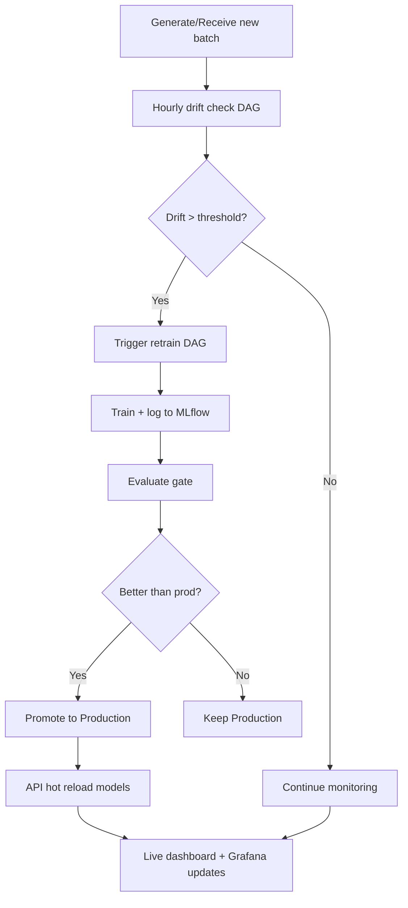

## 1. Product Overview
mlops-platform is an end-to-end MLOps observability platform with automated retraining, drift detection, A/B testing, and real-time monitoring dashboards.
- Target users: ML Platform / MLOps engineers and hiring managers reviewing a portfolio project
- Value: demonstrates production-style orchestration, model governance, and observability across training, serving, and monitoring

## 2. Core Features

### 2.1 User Roles
| Role | Access Method | Core Permissions |
|------|---------------|------------------|
| Viewer | No auth (local/dev) | View monitoring dashboard, view experiment runs, view drift reports |
| Admin | No auth (local/dev) | Trigger model reload, reset A/B stats, change A/B split |

### 2.2 Feature Modules
1. **Overview dashboard**: live metrics (accuracy, drift, latency), drift trend chart, A/B comparison table
2. **Experiments**: browse MLflow runs, inspect params/metrics/tags, compare runs
3. **A/B testing**: live v1 vs v2 summary, winner & significance, split control, reset, history
4. **Drift**: latest drift report summary + recent history, link to generated HTML reports
5. **Serving API**: prediction endpoints (single, forced version, batch), metrics, health, admin reload
6. **Automation**: scheduled drift checks, conditional retraining, registry promotion gates, API hot reload

### 2.3 Page Details
| Page Name | Module Name | Feature Description |
|-----------|-------------|---------------------|
| / | Metric strip | Live accuracy, drift score with thresholds, p95 latency, active model version |
| / | Drift chart | 24h drift line chart with threshold overlay and tooltips |
| / | A/B summary | Side-by-side v1/v2 table: requests, latency, confidence, accuracy, p-value |
| /experiments | Runs table | Sortable runs list: run_id, time, status, key metrics, model version |
| /experiments | Run details | Expand row to show all params, metrics, tags |
| /experiments | Compare | Select 2 runs and show side-by-side metric diff |
| /ab-test | Controls | Set split %, reset counters, winner endpoint display |
| /ab-test | History | Last 24h hourly request counts per version |
| /drift | Latest | Current drift score, share drifted, drifted features, decision flag |
| /drift | Reports | List of recent HTML reports (local path display) |

## 3. Core Process
Primary flows:
- Continuous data simulation produces streaming batches.
- Hourly drift check evaluates the latest batch; if drift exceeds threshold, retraining is triggered.
- Retraining validates data, trains model, evaluates, registers to MLflow, and conditionally promotes to production.
- Serving API loads production as v1 and staging as v2 for A/B testing, exporting Prometheus metrics for Grafana + dashboard polling.

## 4. User Interface Design
### 4.1 Design Style
- Theme: dark-first, high-contrast, utilitarian monitoring feel
- Accent: single bright accent color used for state (healthy/warn/alert)
- Typography: clean system UI for readability in dense tables
- Layout: fixed sidebar (240px), top navbar with theme toggle, content area with responsive grids
- Motion: subtle fade/slide on page transitions and table expansions only

### 4.2 Page Design Overview
| Page Name | Module Name | UI Elements |
|-----------|-------------|-------------|
| / | Metric strip | 4 compact metric cards with colored state indicators |
| / | Drift chart | Line chart with threshold line, hover tooltip, legend |
| /experiments | Runs table | Sort headers, expandable detail panel, compare selection controls |
| /ab-test | Summary + controls | Winner panel, form controls, table, 24h history chart/table |
| /drift | Detail | Badge for drift decision, list of drifted features, recent reports |

### 4.3 Responsiveness
Desktop-first layout; supports narrow widths by collapsing cards to 2x2 grid and turning tables into horizontally scrollable regions.
