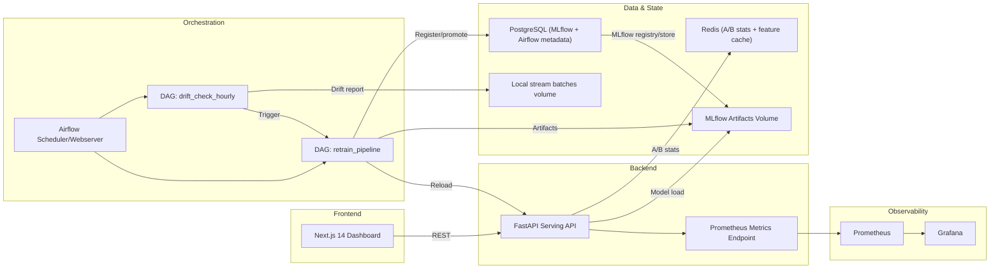
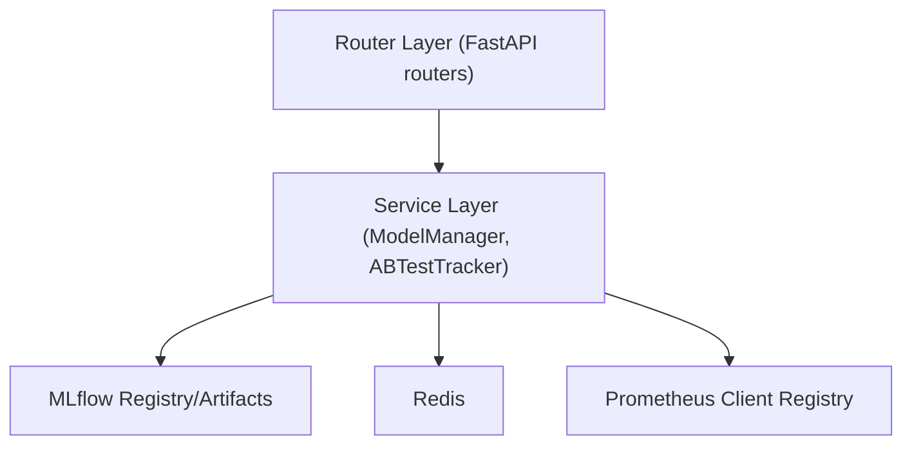
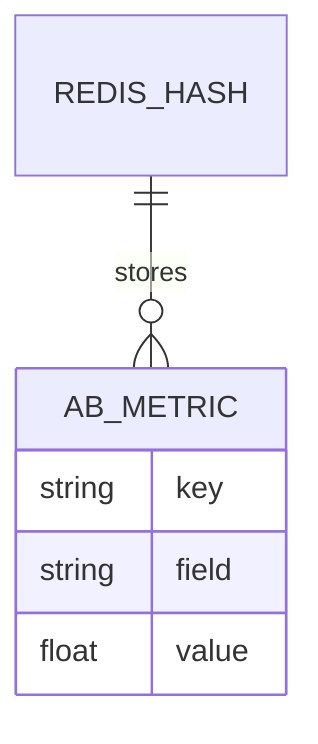

## 1. Architecture Design



## 2. Technology Description
- Orchestration: Apache Airflow 2.8 (LocalExecutor)
- Experiment tracking/registry: MLflow 2.x with PostgreSQL backend store + shared artifact volume
- Drift detection: Evidently AI (reports saved as HTML artifacts)
- Serving API: FastAPI + Uvicorn (Python 3.11)
- Dashboard: Next.js 14 App Router + Tailwind CSS + shadcn/ui conventions
- Metrics: prometheus_client in FastAPI; Prometheus server + Grafana provisioning
- Datastores: PostgreSQL 15, Redis 7
- Containers: Docker + Docker Compose (single network)
- ML: scikit-learn RandomForestClassifier on synthetic data
- Testing: pytest + httpx

## 3. Route Definitions
| Route | Purpose |
|-------|---------|
| / | Overview dashboard (metrics, drift trend, A/B table) |
| /experiments | MLflow runs browser + compare |
| /ab-test | A/B management (summary, winner, split, reset, history) |
| /drift | Drift status and recent reports |

## 4. API Definitions

### 4.1 Core Endpoints
| Method | Route | Purpose |
|--------|-------|---------|
| GET | /health | Health + uptime + model loaded status |
| POST | /predict | Deterministic A/B routed inference |
| POST | /predict/v1 | Force production model |
| POST | /predict/v2 | Force staging model |
| POST | /predict/batch | Batch inference (max 100) |
| GET | /ab-test/summary | Summaries for v1 and v2 |
| GET | /ab-test/winner | Winner with p-value |
| POST | /ab-test/reset | Clear Redis counters |
| POST | /ab-test/split | Update split percent at runtime |
| GET | /ab-test/history | Hourly request counts (last 24h) |
| GET | /metrics | Prometheus scrape endpoint |
| GET | /metrics/summary | JSON metric snapshot for dashboard polling |
| POST | /admin/reload | Hot reload models from MLflow |

### 4.2 Types (High-level)
```ts
export type PredictRequest = {
  features: number[]; // length 10
  user_id: string;
  return_proba?: boolean;
};

export type PredictResponse = {
  prediction: 0 | 1;
  confidence: number;
  model_version: "v1" | "v2";
  latency_ms: number;
  request_id: string;
};

export type MetricsSummary = {
  model_accuracy: Record<string, number>;
  model_drift_score: Record<string, number>;
  p95_latency_ms: number;
  ab_split_percent: number;
  active_model_version: string;
};
```

## 5. Server Architecture Diagram


## 6. Data Model

### 6.1 Data Model Definition
Operational state is primarily in Redis (A/B aggregates) and Prometheus (metrics time series). MLflow and Airflow use PostgreSQL for metadata.



### 6.2 Data Definition Language
PostgreSQL schemas are managed by Airflow and MLflow. Redis uses key patterns:
- ab_test:{version}:counters
- ab_test:{version}:latency_ms
- ab_test:{version}:confidence
- ab_test:{version}:accuracy
